# Monitor the security posture of your IoT application using AWS IoT Device Defender and Splunk #

## Overview ##

With the growing adoption of Internet of Things (IoT) applications in regulated industries, such as healthcare, hardening IoT security devices has become a requirement. In addition to ensuring that backend systems are resilient, organizations increasingly invest effort to secure devices outside the traditional enterprise perimeter with [zero trust principles](https://en.wikipedia.org/wiki/Zero_trust_security_model). For example, fleet operators for connected medical devices need to ensure that the product does not exhibit anomalous behavior and function as designed. When a device’s security posture is compromised, it’s vital that these events are efficiently identified, analyzed, and managed by a centralized security team to safeguard the delivery of end-to-end patient care.

[AWS IoT Device Defender](https://aws.amazon.com/iot-device-defender/), a fully managed cloud service, continuously monitors IoT fleets to detect any abnormal device behavior, trigger security alerts, and provide built-in mitigation actions. This service can audit device-related resources against AWS IoT security best practices, and evaluate device-side and cloud-side metrics in near real-time against a predefined threshold. You can then receive alerts when AWS IoT Device Defender detects deviations. AWS IoT Device Defender also has a feature called [ML Detect](https://docs.aws.amazon.com/iot/latest/developerguide/dd-detect-ml.html) that monitors metrics in near real-time, and applies machine learning (ML) algorithms to detect anomalies, and to raise alerts.

AWS Partners, such as [Splunk](https://www.splunk.com/), provide security information and event management (SIEM) solutions that enable organizations to detect and respond to incidents in near real-time. A security solution that integrates AWS IoT Device Defender with the Splunk Platform can enhance your organization’s security posture by delivering data-driven cyber security to end-to-end IoT applications.

In this repository, we illustrate how you can use AWS IoT Device Defender, [Amazon Data Firehose](https://aws.amazon.com/firehose/), and the Splunk Platform to ingest security-related metrics from IoT devices into a centralized SIEM. We also discuss how you can configure the security system to quickly identify risks and systematically measure their impact.

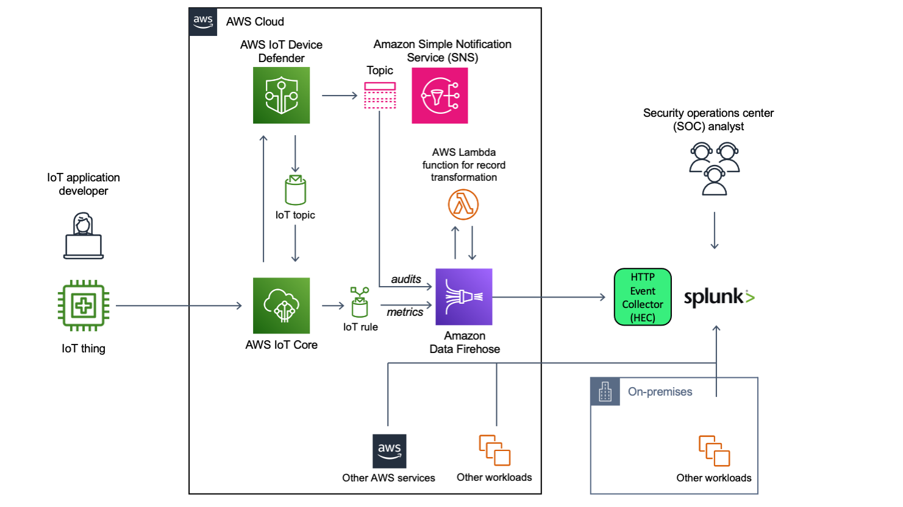

Figure 1: Solution architecture

## AWS Blog post ##

This approach is fully documented in the following blog post:

`TBC`

## Deployment ##

### Deploying the solution ###
An [AWS Serverless Application Model (SAM)](https://aws.amazon.com/serverless/sam/) template has been provided to deploy all AWS resources required by this solution, including the Python code used by the Lambda function.

A Raspberry Pi running the [Raspberry Pi OS (64-bit)](https://www.raspberrypi.com/software/) is being used to simulate the IoT device.

#### AWS prerequisites ####
For this walkthrough, you will need the following AWS prerequisites to be in place: 

* An AWS account
* IAM permissions to deploy the AWS resources using AWS SAM
* Local installation of [AWS SAM Command Line Interface (CLI)](https://docs.aws.amazon.com/serverless-application-model/latest/developerguide/install-sam-cli.html)
* If you want to test this solution using your own IoT devices, you will be required to provision them separately using AWS IoT Core. IoT applications running on the devices should leverage the [AWS IoT Device Client](https://github.com/awslabs/aws-iot-device-client) so that device-side metrics are published automatically using the included AWS IoT Device Defender libraries. If not, this logic would need to be coded into your IoT application.

#### Splunk prerequisites ####

You will also need the following Splunk prerequisites to be in place to ingest the data:
* Splunk deployment (Splunk Enterprise or Splunk Cloud) with [HEC enabled](https://docs.splunk.com/Documentation/AddOns/released/AWS/ConfigureFirehoseOverview)
  * HEC must be accessible via a valid SSL certificate
  * If HEC is deployed behind a load-balancer (for Splunk Enterprise), sticky sessions should be enabled to avoid duplicate messages
* [Splunk Add-on for Amazon Web Services](https://splunkbase.splunk.com/app/1876) (optional, but highly recommended)
  * The Splunk Add-on for Amazon Web Services is a Splunk Add-on which helps preconfigure a large number of out of the box AWS source types. Although AWS IoT Device Defender is not currently one of the out-of-the-box source types, it is still recommended to enable this Splunk Add-on to allow the advanced curation of device data alongside data from AWS resources.
* Splunk index 
  * A Splunk index is a repository of data. You will need a Splunk index so that incoming AWS IoT Device Defender data can be indexed and made searchable.

#### Configuring Splunk ####
##### Setup HEC token for Amazon Data Firehose #####
1. Login to your Splunk Console and select **Settings**, then **Data inputs**. 

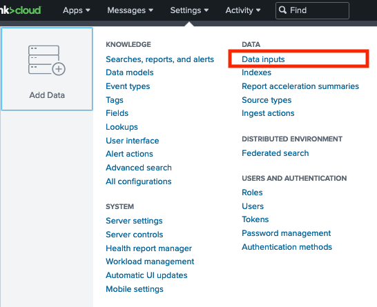

Figure 2: Configuring a new data input

2. From the **Data inputs** panel select **+ Add new** from the **HTTP Event Collector** section.

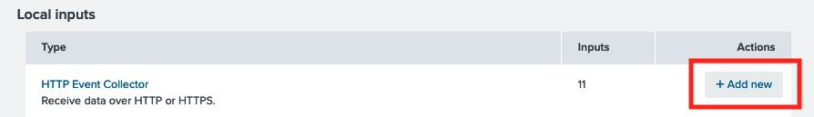

Figure 3: Add a new HEC data input

3. From the **Add Data** screen enter a **Name**, select **Enable indexer acknowledgement** and select **Next**.

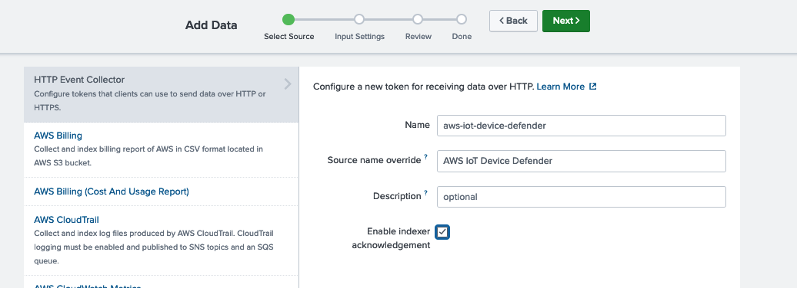

Figure 4: Select a HEC configuration name

4. From the **Input Settings** screen, select **Structured**, then `aws:firehose:json` as your **Source type**.
5. For **Select Allowed Indexes**, select the index you wish to send the AWS IoT Device Defender data to. Select **Review** when done. In this example, we have chosen an index named `aws_hfb`.

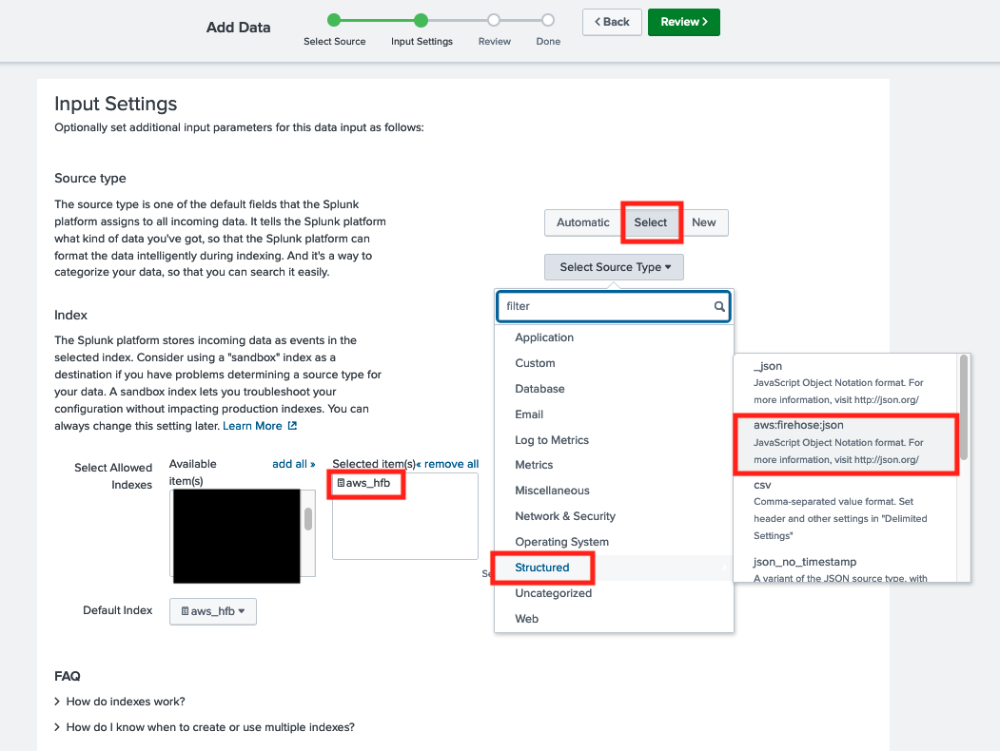

Figure 5: Select HEC input settings

6. Review the details and select **Submit** when done. 
7. Once you have successfully created the HEC configuration, you will be able to obtain the **Token Value** from the list of HTTP Event Collector configurations. You will need this value when configuring the Firehose delivery stream.
 
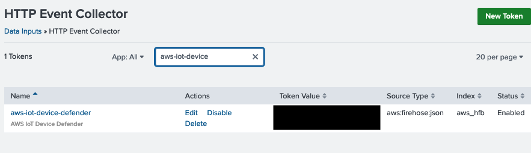

Figure 6: View the HEC token value

##### Obtain Splunk HEC URL #####
Depending on your Splunk deployment, the assigned HEC URLs will vary. For most Splunk Cloud deployments, the URL will be in the format `https://http-inputs-firehose-<host>.splunkcloud.com:443`. For more information on Splunk HEC URLs, visit *[Set up and use HTTP Event Collector in Splunk Web](https://docs.splunk.com/Documentation/Splunk/latest/Data/UsetheHTTPEventCollector)*.

You now have the HEC URL and Token Value which are required at the time of the AWS SAM template deployment.

#### Storing the Splunk HEC token in AWS Secrets Manager ####

AWS Secrets Manager is used to store the Splunk HEC token so that it can be dynamically referenced at the time of the AWS SAM template deployment.

1. Navigate to **AWS Secrets Manager** and select **Store a new secret** to create a new secret.

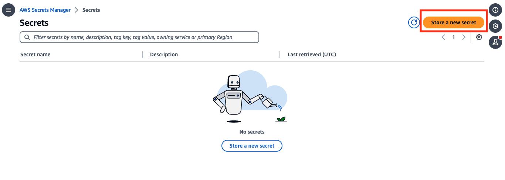

Figure 7: Creating a new secret

2. Select **Other type of secret** and enter `splunkHECToken` as the **Key**. For **Value**, enter the Splunk HEC token you retrieved earlier. Select **Next**.

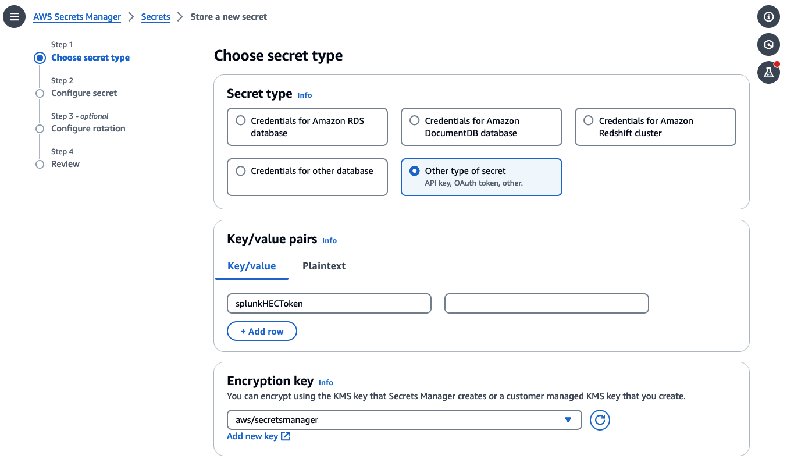

Figure 8: Choosing secret type

3. Enter `splunkHECToken` as the **Secret name**. Select **Next**. Complete the remaining configuration of the new secret with default settings.

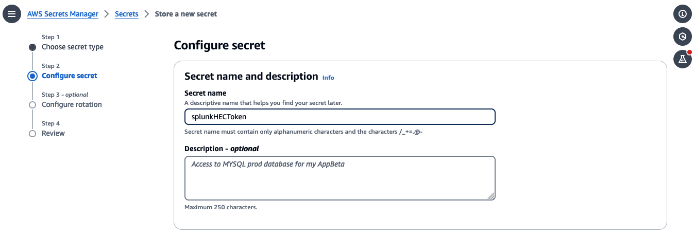

Figure 9: Configuring the secret

#### Deploying the AWS SAM template ####

An aws-samples [GitHub repository](https://github.com/aws-samples/aws-iot-device-defender-and-splunk/) containing the SAM template (including the Lambda code) has been made available so that you can test this solution yourself.

1. Follow the steps in the [official documentation](https://docs.aws.amazon.com/serverless-application-model/latest/developerguide/install-sam-cli.html) to install the latest release of the AWS SAM CLI for your operating system.
2. Once successfully installed, run `sam --version` to return the AWS SAM CLI version.

> Note: The AWS SAM CLI requires appropriate permissions to provision resources in the chosen AWS account. Ensure that [access key and secret access keys](https://docs.aws.amazon.com/serverless-application-model/latest/developerguide/prerequisites.html) have been created using IAM, and that aws configure has been used to register them locally on your machine.

3. To download all required files to your local machine, run the following command.

`git clone https://github.com/aws-samples/aws-iot-device-defender-and-splunk`

4. Navigate to the sam directory.

`cd sam`

5. Build the SAM application.

`sam build`

6. Deploy the application.

`sam deploy --guided`

7. When prompted, enter the unique details chosen for your environment (you can keep the remainder as defaults). In this example, we have chosen `deviceDefenderSplunkDemo` as the AWS CloudFormation stack name, and `aws_iot_device_defender` as the Splunk [source type](https://docs.splunk.com/Splexicon:Sourcetype).

```
Stack Name [sam-app]: <Your CloudFormation stack name>
AWS Region [eu-west-1]: <Your AWS Region>
Parameter splunkHECEndpoint []: <Your Splunk HEC endpoint>
Parameter splunkHECTokenSecretName: <Name of your AWS Secrets Manager secret storing the Splunk HEC token>
Parameter splunkSourceType [aws_iot_device_defender]: <Your Splunk event source type>
```

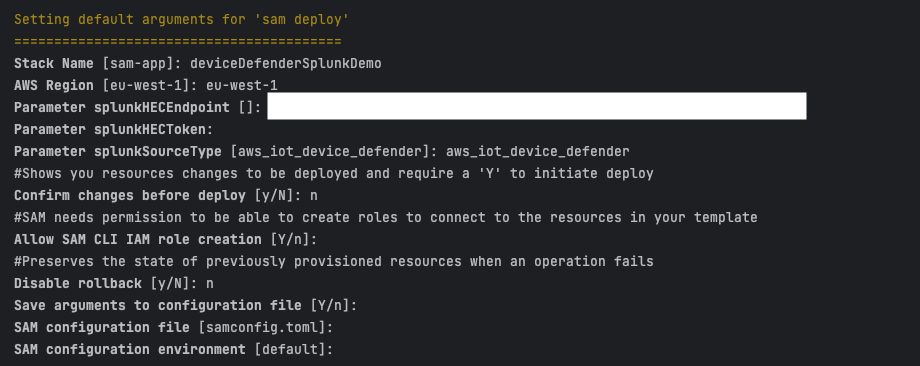

Figure 10: Deploying the SAM template

8. Confirm that the `Successfully created/updated stack` message is shown. 


Figure 11: Confirming successful deployment of SAM template

9. Note down the name of the AWS IoT thing created. This value is outputted by the CloudFormation stack. In this example, the thing name is `deviceDefenderSplunkDemo-IoT-Thing`.
 
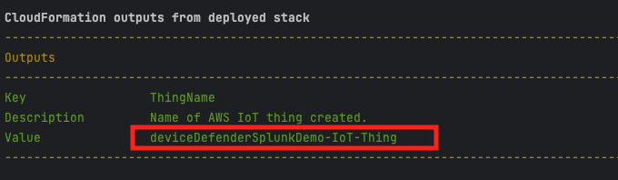

Figure 12: Noting down the AWS IoT thing name

You are now ready to test the solution.

### Testing the solution ###
To test the solution, we are going to simulate a healthcare device that has potentially been compromised. In this scenario, the rogue device has been tampered with, and has had an FTP server application (`vsftpd`) installed. As a result, it is now listening on an unexpected network port (TCP/21), and the device remains vulnerable to data exfiltration and unauthorized access.

For purposes of the demonstration, the following steps will be performed on a Raspberry Pi 4 device running the Raspberry Pi OS (64-bit), but the process can be similarly repeated on other operating systems running a supported Linux kernel.

#### Generate and download the AWS IoT certificates and keys ####

1. The CloudFormation template has deployed a device in AWS IoT Core, but certificates are yet to be generated. Navigate to the **AWS IoT console**, **All devices**, then **Things**. Select the thing with the name of your CloudFormation stack, and generate the certificates using the **Create certificate** button. 

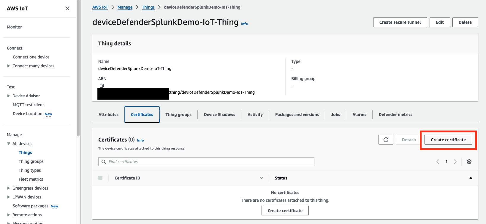

Figure 13: Generating device certificates

2. Make sure that the device certificate is activated, and that device certificate, public key file, private key file and Amazon root certificate have all been securely downloaded. These will be required on the Raspberry Pi device for authentication and authorization with AWS IoT Core.

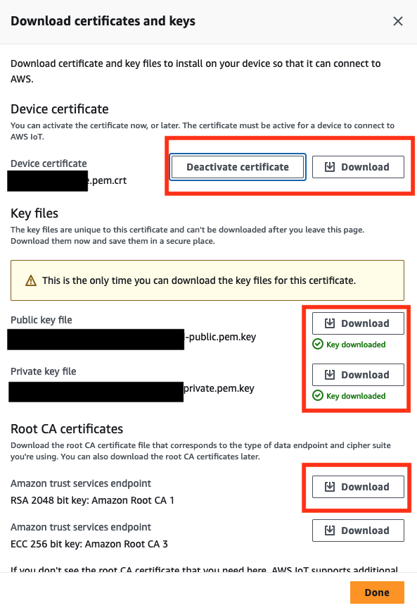

Figure 14: Downloading device certificates

3. Click on the certificate ID back in the **AWS IoT console**. Under the **Policies** tab, select the **Attach policies** button and attach to the device policy that has been generated for you by the CloudFormation template. This will ensure that the device has the permissions needed to connect, publish and subscribe to the AWS IoT Device Defender’s reserved MQTT topics.

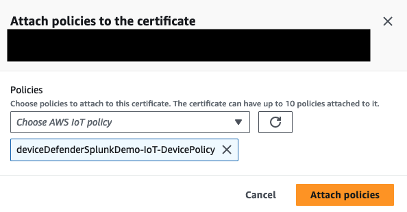

Figure 15: Attaching device certificate to policy

4. The CloudFormation template has already created an AWS IoT Core thing group which is mapped to the AWS IoT Device Defender security profile. Back on the thing page in the **AWS IoT console**, under the **Thing groups** tab, select the **Add to group** button and add the thing to this thing group.

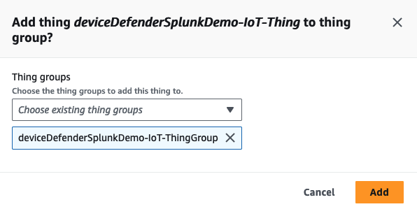

Figure 16: Adding thing to thing group

Cloud-side metrics will now start to be generated automatically for the device and ingested into Splunk. 

#### Install and run the AWS IoT Device Defender Agent SDK for Python ####

In order to generate device-side metrics, we will use the [AWS IoT Device Defender Agent SDK for Python](https://github.com/aws-samples/aws-iot-device-defender-agent-sdk-python).

1. Note down the AWS IoT Core endpoint details from the **AWS IoT console**.

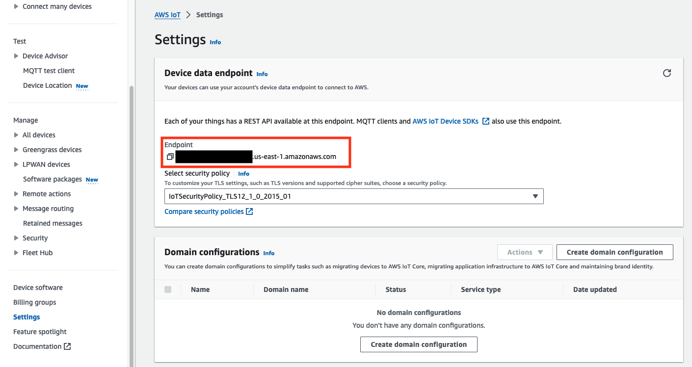

Figure 17: Noting down the AWS IoT Core endpoint

2. On the Raspberry Pi, create a directory for certificates called `/certs`, and upload the previously downloaded certificate files using a file manager or a secure copy command supported by your workstation. We have renamed the files `AmazonRootCA1.pem`, `certificate.pem.crt` and `private.pem.key` to simplify this example.

```
cd ~
mkdir certs
```

3. Install the [AWS IoT Python SDK](https://github.com/aws/aws-iot-device-sdk-python) by cloning it from GitHub, and running the installer. The AWS IoT Python SDK is a prerequisite for the AWS IoT Device Defender Agent SDK for Python.

```
git clone https://github.com/aws/aws-iot-device-sdk-python.git
cd aws-iot-device-sdk-python
python setup.py install
```

4. Clone the [AWS IoT Device Defender Agent SDK for Python](https://github.com/aws-samples/aws-iot-device-defender-agent-sdk-python) GitHub repository.

```
cd ..
git clone https://github.com/aws-samples/aws-iot-device-defender-agent-sdk-python.git
```
5.	Install the AWS IoT Device Defender Agent SDK for Python using the installer.

```
cd aws-iot-device-defender-agent-sdk-python
pip install AWSIoTDeviceDefenderAgentSDK
```

5. Run the sample agent using the AWS endpoint and `ThingName` details noted down earlier, along with the path to the certificates.

> Note: If you ran the previous steps in different directories, ensure that the relative paths reflect the file locations in your environment.

```
cd ~
python aws-iot-device-defender-agent-sdk-python/AWSIoTDeviceDefenderAgentSDK/agent.py --endpoint <your.custom.endpoint.amazonaws.com> --rootCA certs/AmazonRootCA1.pem --cert certs/certificate.pem.crt --key certs/private.pem.key --format json -i 300 -id <ThingName>
```

7. Confirm that no errors are returned, that the agent connects successfully to the endpoint, and that it subscribes to the reserved AWS IoT Device Defender reserved MQTT topics and publishes data every 5 minutes.

```
Connecting to <your.custom.endpoint.amazonaws.com> with client ID 'deviceDefenderSplunkDemo-IoT-Thing'...
Subscribed to $aws/things/deviceDefenderSplunkDemo-IoT-Thing/defender/metrics/json/accepted with 1
Subscribed to $aws/things/deviceDefenderSplunkDemo-IoT-Thing/defender/metrics/json/rejected with 1
```

8. Once it has been tested that the agent runs correctly, you can run it as a background process using the `$` operator.

```
python aws-iot-device-defender-agent-sdk-python/AWSIoTDeviceDefenderAgentSDK/agent.py --endpoint <your.custom.endpoint.amazonaws.com> --rootCA certs/AmazonRootCA1.pem --cert certs/certificate.pem.crt --key certs/private.pem.key --format json -i 300 -id <ThingName> &
```

#### Simulate the opening of a network vulnerability ####
1. We will now install an FTP server application – `vsftpd` – on the IoT device to open a new TCP listening port.

```
sudo apt install vsftpd
```

> Note: Depending on your operating system, you may be required to enable and start the `vsfptd` service, for example by running `sudo systemctl enable vsftpd` and `sudo systemctl start vsftpd`.

2. Confirm after installation that there is now a new TCP port listening on port 21 by running `netstat`. 

> Note: Some ports are duplicated for both IPv4 and IPv6.

```
netstat -plnt
```

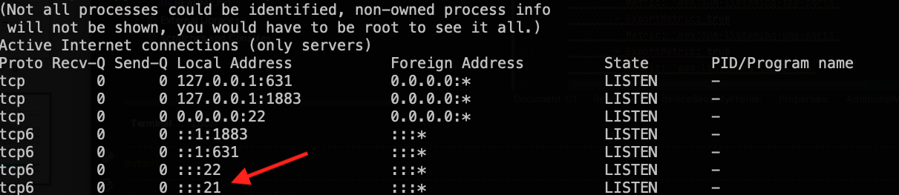

Figure 18: Displaying open TCP ports on the device

We are now ready to see if we can detect this anomaly in Splunk.

#### Analyzing the events from Splunk ####

1. Navigate to the **Search & Reporting Splunk App** in the **Splunk console**, and use the following Splunk Processing Language (SPL) query:

```
index="<YOUR INDEX>" sourcetype="<YOUR SPLUNK SOURCE TYPE>"
```
The search will return all cloud and client-side metrics, as well as audit reports, generated by AWS IoT Device Defender and will prove that the data is being ingested into the chosen index.

##### Metrics #####

1. We will now write a new SPL query to monitor the `aws:num-listening-tcp-ports` value over time, by device.

```
index="<YOUR INDEX>" sourcetype="<YOUR SPLUNK SOURCE TYPE>"| spath name | search name="aws:num-listening-tcp-ports" 
| chart max(value.count) as tcp_count over _time by thing
```

This query demonstrates that the total count of open TCP ports has changed on a single device, which warrants a deeper investigation by a security analyst.

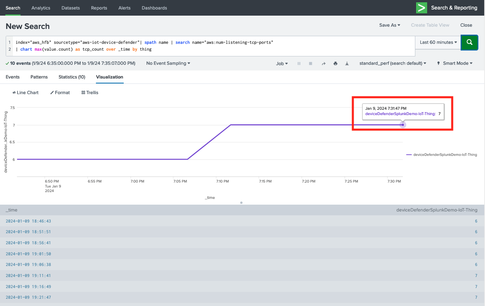

Figure 19: Displaying total number of open TCP ports

2. As we now know the name of the device exhibiting suspicious behavior, we will run another SPL query to determine which ports are open.

```
index="<YOUR INDEX>" sourcetype="<YOUR SPLUNK SOURCE TYPE>"| where thing="<YOUR THING NAME>" 
| spath name 
| search name="aws:listening-tcp-ports" 
| spath value.ports{} output=open-ports
| mvexpand open-ports
| chart count(open-ports) over _time by open-ports
```

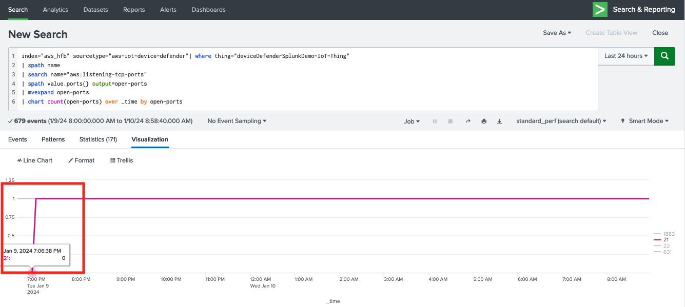

Figure 20: Displaying open TCP ports on device

3. The security analyst can further interrogate other data points, such as `aws:all-packets-out` or `aws:all-bytes-out` to see if there may be other indicators of data exfiltration. These can be assessed alongside data from other devices, such as network switches, routers and workstations, to provide a complete picture of what might have happened to this device, and the level of risk posed to the organization.

##### Audit reports #####

Audits can be scheduled, or run immediately. Navigate to **Audit**, then **Results** in the **AWS IoT console**, and select **Create**. Select **Available checks**, and select **Run audit now (once)** under **Set schedule**, before selecting **Create**.

The security analyst can track the status of the historical audit reports over time using SPL such as the below:

```
index="<YOUR INDEX>" sourcetype="<YOUR SPLUNK SOURCE TYPE>"| where isnotnull(checkName)
```

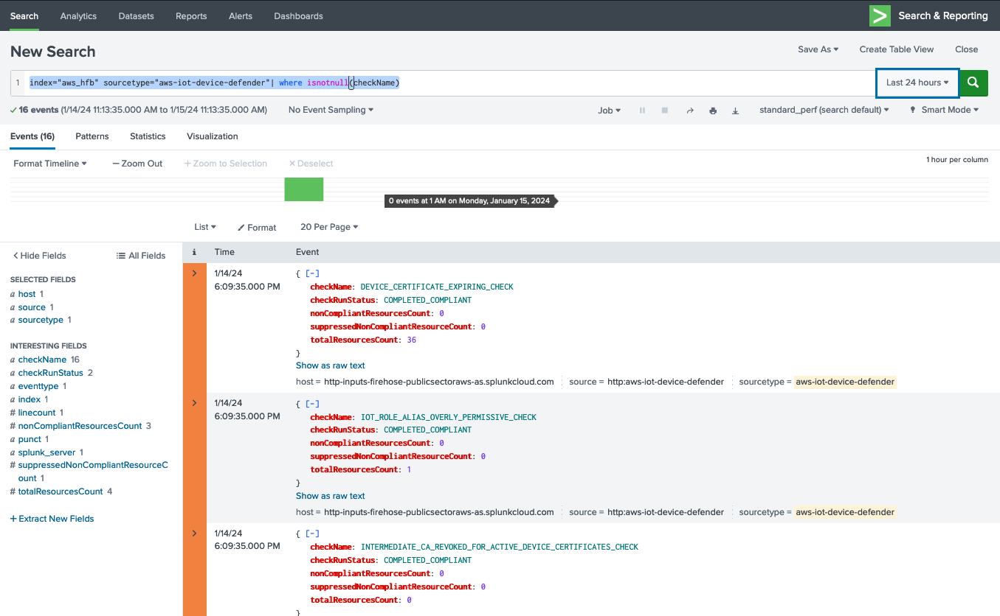

Figure 21: Displaying audit reports

### S3 bucket ###

The solution deploys an Amazon S3 bucket to back up data that failed to be ingested into Splunk. This is facilitated through the [backup settings](https://docs.aws.amazon.com/firehose/latest/dev/create-configure.html) feature of Firehose.

Refer to the Splunk blog post [AWS Firehose to Splunk - Two Easy Ways to Recover Those Failed Events](https://www.splunk.com/en_us/blog/tips-and-tricks/aws-firehose-to-splunk-two-easy-ways-to-recover-those-failed-events.html) for approaches on how to replay failed events.

### Cleaning up ###
To avoid incurring future charges, delete the CloudFormation stacks that have been provisioned. This can be achieved using:

```
sam delete
```

You may be required to empty the S3 bucket created for Firehose and detach AWS IoT Core policy targets from the device policy that has been created if the CloudFormation stack is failing to delete.
